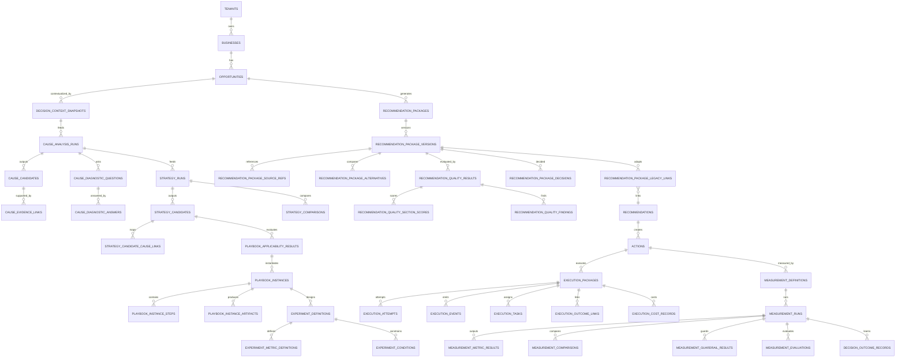

# LOOFIO Data Schema — Decision Intelligence v1

## 1. 문서 목적

이 문서는 현재 Hospital Appointment MVP의 PostgreSQL 스키마 위에 다음 Decision Intelligence 계층을 **additive migration**으로 추가하기 위한 데이터 모델을 정의한다.

```text
Opportunity
→ Decision Context
→ Cause Analysis
→ Strategy Comparison
→ Playbook Instance
→ Experiment Definition
→ Recommendation Package
→ Quality Result
→ User Decision
→ Manual / Staff Execution
→ Result
→ Measurement
→ Decision Outcome Learning
```

이 문서는 현재 구현된 스키마를 설명하는 문서가 아니다.

```text
현재 실행 가능한 Source of Truth
→ api/migrations/0001~0011

이 문서
→ 0012 이후 migration 설계 제안
```

Migration·repository·test가 구현되기 전에는 본 문서의 테이블이 존재한다고 가정하지 않는다.

---

# 2. 현재 스키마 Snapshot

현재 `main`의 migration은 `0001`부터 `0011`까지다.

## 2.1 현재 핵심 테이블

```text
Tenant / Auth
├─ tenants
├─ users
├─ tenant_members
├─ user_identities
└─ sessions

Hospital Domain
├─ businesses
├─ locations
├─ offerings
├─ customers
└─ appointments

Import
├─ import_jobs
├─ import_rows
└─ appointment_import_mappings

Opportunity
├─ opportunities
└─ opportunity_evidence

Recommendation
├─ recommendations
└─ recommendation_decisions

Action / Result
├─ actions
├─ action_status_events
└─ action_results
```

현재 Measurement는 별도 테이블에 저장하지 않고 `action_results`의 측정 기간과 `appointments`를 이용해 요청 시 계산한다.

## 2.2 현재 주요 계약

```text
Appointment status
→ booked / completed / cancelled / no_show / unknown

Opportunity status
→ open / resolved / dismissed

Recommendation decision
→ approved / rejected / modified / later

Action status
→ planned / in_progress / completed / cancelled

Current Measurement
→ same-window-prior-four-weeks-v2
```

## 2.3 현재 Schema Source of Truth

```text
1. api/migrations/*.sql
2. api/app repository/store
3. api/tests
4. docs/LOOFIO_DATA_SCHEMA_V1.md
```

---

# 3. Schema 설계 원칙

## 3.1 Additive 우선

기존 테이블·Endpoint·상태 의미를 즉시 교체하지 않는다.

```text
기존 recommendations
기존 recommendation_decisions
기존 actions
기존 action_results
```

를 유지하면서 새 객체를 병렬 추가한다.

## 3.2 Preview-first

첫 구현은 다음을 우선한다.

```text
Pure Domain
Pydantic Contract
Static Registry
In-memory Resolver
Preview API
Golden Fixture
```

Persistence는 M8에서 적용한다.

## 3.3 Tenant·Business를 모든 운영 Row에 명시

가능한 모든 tenant-owned 테이블은 다음을 가진다.

```text
tenant_id
business_id
```

그리고 상위 객체와 composite FK를 사용한다.

```text
FOREIGN KEY (tenant_id, business_id, parent_id)
REFERENCES parent_table(tenant_id, business_id, id)
```

단순 UUID PK가 전역적으로 unique여도 DB 수준 tenant mismatch를 차단하기 위해 composite scope를 추가한다.

## 3.4 실행 지식과 Runtime Data 분리

```text
Registry Definition
→ 코드 또는 global catalog

Tenant Runtime
→ applicability / instance / package / action
```

Playbook Definition에 특정 병원·고객·예산을 저장하지 않는다.

## 3.5 Immutable Content + Audited Lifecycle

다음 내용은 revision 또는 새 Run으로 보존한다.

```text
Decision Context Snapshot
Cause Run
Strategy Run
Playbook Instance content
Experiment Definition
Recommendation Package revision
Quality Result
Measurement Run
```

상태 변화는 별도 Event 또는 감사 컬럼으로 추적한다.

## 3.6 계산 Source와 표현 분리

점수·금액·Metric은 일반 컬럼 또는 versioned numeric result로 저장한다.

설명·복합 조건·evidence snapshot은 JSONB를 사용할 수 있다.

## 3.7 JSONB를 만능 저장소로 사용하지 않는다

일반 컬럼으로 저장할 값:

```text
tenant_id / business_id
foreign key
status
type/code
version
score
money amount/currency
start/end
revision
selected flag
created_at
```

JSONB가 적합한 값:

```text
복합 Target 조건
Source summary
Score breakdown
Requirement list
Channel plan
Step instructions
Assumptions / limitations
Provider-normalized metadata
```

## 3.8 PostgreSQL ENUM보다 text + CHECK

현재 migration 스타일을 유지한다.

```sql
status text NOT NULL CHECK (status IN (...))
```

상태 확장 시 PostgreSQL ENUM보다 migration 변경이 단순하다.

## 3.9 삭제보다 상태·만료

Audit 대상 객체는 물리 삭제보다 다음을 사용한다.

```text
cancelled
superseded
deprecated
blocked
expired
invalidated
```

---

# 4. Schema Layer

```text
A. Compatibility Foundation
B. Decision Input
C. Cause Analysis
D. Strategy
E. Playbook Runtime
F. Experiment
G. Recommendation Package / Quality
H. Channel Execution
I. Measurement / Learning
J. Optional Registry Operations
```

---

# 5. 구현 단계별 테이블 범위

## 5.1 M1~M7 Preview 단계

DB 신규 테이블 없이 구현 가능:

```text
Decision Context request payload
Cause preview
Strategy preview
Static Playbook registry
Experiment preview
Recommendation Package preview
Quality preview
Manual Action adapter
Current Measurement adapter
```

## 5.2 M8 Persistence 최소 범위

우선 Persistence 대상:

```text
decision_context_snapshots
cause_analysis_runs
cause_candidates
cause_evidence_links
cause_diagnostic_questions
cause_diagnostic_answers

strategy_runs
strategy_candidates
strategy_candidate_cause_links
strategy_comparisons

playbook_applicability_results
playbook_instances
playbook_instance_steps
playbook_instance_artifacts

experiment_definitions
experiment_metric_definitions
experiment_conditions

recommendation_packages
recommendation_package_versions
recommendation_package_source_refs
recommendation_package_alternatives
recommendation_package_status_events
recommendation_package_decisions
recommendation_package_legacy_links

recommendation_quality_results
recommendation_quality_section_scores
recommendation_quality_findings
```

## 5.3 M8 후속 Persistence

```text
execution_packages
execution_approvals
execution_tracking_contracts
execution_attempts
execution_events
execution_tasks
execution_outcome_links
execution_cost_records

measurement_definitions
measurement_runs
measurement_metric_results
measurement_comparisons
measurement_cost_records
measurement_guardrail_results
measurement_evaluations
decision_outcome_records
```

## 5.4 추후 운영 UI가 필요할 때

```text
playbook_definitions
playbook_versions
playbook_aliases
playbook_rollout_scopes

experiment_templates
experiment_template_versions

channel_connections
channel_capabilities
business_decision_profiles
offering_decision_profiles
```

첫 vertical slice에서는 Registry를 코드에 두고 사용한 ID·version·hash를 Snapshot에 저장해도 된다.

---

# 6. 권장 Migration 순서

현재 latest migration이 `0011`이므로 다음 번호를 제안한다.

실제 구현 직전에 `main`의 최신 번호를 다시 확인한다.

| Migration | 목적 | 주요 테이블·변경 |
|---|---|---|
| `0012_decision_intelligence_scope_foundation.sql` | composite tenant/business FK 기반 | 기존 parent unique constraints, action_result scope hardening |
| `0013_decision_context_and_cause.sql` | Context Snapshot·Cause | decision_context_snapshots, cause_* |
| `0014_strategy_runs.sql` | Strategy 비교 | strategy_* |
| `0015_playbook_runtime.sql` | Applicability·Instance | playbook_applicability_results, playbook_instances, steps, artifacts |
| `0016_experiment_definitions.sql` | 실행 전 실험 계약 | experiment_definitions, metrics, conditions |
| `0017_recommendation_packages.sql` | Package·revision·decision | recommendation_package_* |
| `0018_recommendation_quality.sql` | Quality result | recommendation_quality_* |
| `0019_channel_execution.sql` | Manual/Staff Execution | execution_* |
| `0020_measurement_persistence.sql` | Measurement·Learning | measurement_*, decision_outcome_records |

## 권장 배포 단위

```text
M8-A
→ 0012~0014

M8-B
→ 0015~0016

M8-C
→ 0017~0018

M8-D
→ 0019~0020
```

한 번에 9개 migration을 운영에 적용하지 않는다.

---

# 7. Migration 0012 — Scope Foundation

## 7.1 목적

현재 부모 테이블에 tenant/business composite reference를 추가해 신규 child row가 다른 tenant·business의 parent를 참조하지 못하게 한다.

## 7.2 추가 권장 Unique Constraint

```sql
ALTER TABLE opportunities
    ADD CONSTRAINT opportunities_tenant_business_id_unique
    UNIQUE (tenant_id, business_id, id);

ALTER TABLE recommendations
    ADD CONSTRAINT recommendations_tenant_business_id_unique
    UNIQUE (tenant_id, business_id, id);

ALTER TABLE actions
    ADD CONSTRAINT actions_tenant_business_id_unique
    UNIQUE (tenant_id, business_id, id);

ALTER TABLE action_results
    ADD CONSTRAINT action_results_tenant_id_unique
    UNIQUE (tenant_id, id);
```

## 7.3 기존 Relation 검증

Migration 전 Preflight:

```sql
SELECT r.id
FROM recommendations r
JOIN opportunities o ON o.id = r.opportunity_id
WHERE r.tenant_id <> o.tenant_id
   OR r.business_id <> o.business_id;
```

```sql
SELECT a.id
FROM actions a
JOIN recommendations r ON r.id = a.recommendation_id
WHERE a.tenant_id <> r.tenant_id
   OR a.business_id <> r.business_id;
```

```sql
SELECT ar.id
FROM action_results ar
JOIN actions a ON a.id = ar.action_id
WHERE ar.tenant_id <> a.tenant_id;
```

결과가 0건이어야 한다.

## 7.4 기존 Constraint 교체 여부

기존 simple FK는 즉시 제거하지 않는다.

```text
simple FK 유지
+
신규 테이블은 composite FK 사용
```

기존 테이블 자체의 composite FK 강화는 별도 expand/contract migration으로 진행할 수 있다.

---

# 8. Decision Context

## 8.1 `decision_context_snapshots`

Opportunity 판단 시점의 전체 입력을 불변 Snapshot으로 저장한다.

| Column | Type | Required | 설명 |
|---|---|:---:|---|
| id | uuid | Y | PK |
| tenant_id | uuid | Y | Tenant |
| business_id | uuid | Y | Business |
| opportunity_id | uuid | Y | 대상 Opportunity |
| context_version | text | Y | `decision-input-v1` |
| readiness_version | text | Y | `decision-readiness-v1` |
| readiness_level | text | Y | D0~D4 |
| status | text | Y | valid / invalid / superseded |
| as_of | timestamptz | Y | 판단 기준 시각 |
| data_window_start | timestamptz | Y | 분석 시작 |
| data_window_end | timestamptz | Y | 분석 종료 |
| business_timezone | text | Y | 표시·Bucket 시간대 |
| payload | jsonb | Y | 전체 Decision Context |
| source_summary | jsonb | Y | 사용 Source와 상태 |
| missing_requirements | jsonb | Y | blocking/optional 결측 |
| assumptions | jsonb | Y | Snapshot 생성 시 가정 |
| limitations | jsonb | Y | 입력 한계 |
| input_hash | text | Y | canonical payload hash |
| created_by_user_id | uuid | N | 사용자 입력 기반일 때 |
| created_at | timestamptz | Y | 생성 시각 |

Check:

```text
readiness_level IN ('D0','D1','D2','D3','D4')
status IN ('valid','invalid','superseded')
data_window_end > data_window_start
jsonb_typeof(payload) = 'object'
```

Unique:

```text
(tenant_id, business_id, opportunity_id, context_version, input_hash)
```

Composite FK:

```text
(tenant_id, business_id, opportunity_id)
→ opportunities(tenant_id, business_id, id)
```

## 8.2 `decision_context_assumptions`

Snapshot의 가정을 검색·감사할 필요가 있을 때 사용한다.

| Column | Type | 설명 |
|---|---|---|
| id | uuid | PK |
| tenant_id | uuid | scope |
| business_id | uuid | scope |
| decision_context_snapshot_id | uuid | Snapshot |
| assumption_code | text | 안정적 code |
| statement | text | 가정 문장 |
| status | text | proposed / user_confirmed / data_supported / rejected / expired |
| source_type | text | user / metric / profile |
| source_reference | text | source path |
| impact_area | jsonb | 영향 단계 |
| validation_method | text | 확인 방법 |
| owner_user_id | uuid | 담당 |
| expires_at | timestamptz | 만료 |
| created_at | timestamptz | 생성 |

초기에는 Snapshot JSONB로 충분하면 별도 테이블을 생략할 수 있다.

## 8.3 재사용 입력 Profile — 후속 선택

첫 M8에서는 Snapshot만 저장한다.

다음 값이 반복 입력돼 운영 부담이 생기면 추가한다.

```text
business_decision_profiles
offering_decision_profiles
business_channel_capability_profiles
customer_activation_capability_snapshots
```

Profile은 mutable current state가 아니라 versioned row로 저장하는 것을 권장한다.

---

# 9. Cause Analysis

## 9.1 `cause_analysis_runs`

| Column | Type | Required | 설명 |
|---|---|:---:|---|
| id | uuid | Y | Run PK |
| tenant_id | uuid | Y | scope |
| business_id | uuid | Y | scope |
| opportunity_id | uuid | Y | Opportunity |
| decision_context_snapshot_id | uuid | Y | 입력 Snapshot |
| cause_analysis_version | text | Y | `cause-analysis-v1` |
| score_version | text | Y | `cause-priority-v1` |
| status | text | Y | run status |
| selected_candidate_code | text | N | 표시용 top candidate; 원인 확정 아님 |
| input_hash | text | Y | 재현성 |
| as_of | timestamptz | Y | 평가 기준 |
| global_limitations | jsonb | Y | 전체 한계 |
| generated_by | text | Y | deterministic / system |
| created_by_user_id | uuid | N | 수동 실행 사용자 |
| created_at | timestamptz | Y | 생성 |

Status:

```text
PENDING
COMPLETED
NEEDS_DATA
BLOCKED_BY_DATA_QUALITY
INVALID_INPUT
FAILED
```

Unique:

```text
(tenant_id, business_id, opportunity_id,
 decision_context_snapshot_id, cause_analysis_version, input_hash)
```

## 9.2 `cause_candidates`

| Column | Type | 설명 |
|---|---|---|
| id | uuid | PK |
| tenant_id / business_id | uuid | scope |
| cause_analysis_run_id | uuid | Run |
| cause_code | text | Taxonomy code |
| status | text | REVIEWABLE / NEEDS_DATA / DEPRIORITIZED / NOT_APPLICABLE / BLOCKED |
| stable_order | smallint | deterministic tie-break |
| hypothesis | text | 가설 |
| review_priority_score | numeric(5,2) | 0~100, nullable |
| score_version | text | score version |
| evidence_strength | text | strong/moderate/weak/insufficient |
| score_breakdown | jsonb | factor values |
| required_inputs | jsonb | 충족/누락 |
| missing_optional_inputs | jsonb | 선택 누락 |
| downstream_blockers | jsonb | Strategy 차단 |
| diagnostic_question_ids | jsonb | 질문 참조 |
| limitations | jsonb | 한계 |
| created_at | timestamptz | 생성 |

Unique:

```text
(cause_analysis_run_id, cause_code)
```

Check:

```text
review_priority_score IS NULL
OR review_priority_score BETWEEN 0 AND 100
```

## 9.3 `cause_evidence_links`

Opportunity Evidence와 Decision Context field를 하나의 Link 계약으로 저장한다.

| Column | Type | 설명 |
|---|---|---|
| id | uuid | PK |
| tenant_id / business_id | uuid | scope |
| cause_candidate_id | uuid | Candidate |
| evidence_role | text | supporting / contradicting |
| source_type | text | opportunity_evidence / decision_context / historical_action / external_context |
| opportunity_evidence_id | uuid | 선택 FK |
| source_entity_id | uuid | 기타 source UUID |
| source_path | text | JSON path·field path |
| source_version | text | source version |
| source_hash | text | 불변 hash |
| evidence_snapshot | jsonb | 표시용 최소 snapshot |
| created_at | timestamptz | 생성 |

Check:

```text
evidence_role IN ('supporting','contradicting')
```

최소 하나의 source reference가 필요하다.

## 9.4 `cause_diagnostic_questions`

| Column | Type | 설명 |
|---|---|---|
| id | uuid | PK |
| tenant_id / business_id | uuid | scope |
| cause_analysis_run_id | uuid | Run |
| cause_candidate_id | uuid | Candidate nullable |
| question_code | text | 안정적 code |
| field_path | text | Decision Input path |
| question_text | text | 사용자 질문 |
| answer_type | text | boolean/integer/money/enum/date 등 |
| priority | text | required / blocking / optional |
| why_needed | text | 영향 설명 |
| allowed_answers | jsonb | enum 등 |
| pii_class | text | none / restricted |
| readiness_effect | jsonb | 답변별 변화 |
| status | text | open / answered / dismissed / expired |
| created_at | timestamptz | 생성 |

Unique:

```text
(cause_analysis_run_id, question_code, field_path)
```

## 9.5 `cause_diagnostic_answers`

답변 이력은 append-only로 저장한다.

| Column | Type | 설명 |
|---|---|---|
| id | uuid | PK |
| tenant_id / business_id | uuid | scope |
| diagnostic_question_id | uuid | Question |
| answer_version | integer | 1부터 증가 |
| answer_status | text | accepted / rejected / superseded |
| answer_payload | jsonb | 구조화 답변 |
| source_type | text | user_entered / system_observed / imported |
| source_reference | text | source |
| answered_by_user_id | uuid | 사용자 |
| answered_at | timestamptz | 답변 시각 |
| supersedes_answer_id | uuid | 이전 답변 |

Unique:

```text
(diagnostic_question_id, answer_version)
```

---

# 10. Strategy

## 10.1 `strategy_runs`

| Column | Type | 설명 |
|---|---|---|
| id | uuid | PK |
| tenant_id / business_id | uuid | scope |
| opportunity_id | uuid | Opportunity |
| cause_analysis_run_id | uuid | Cause Run |
| decision_context_snapshot_id | uuid | Context |
| strategy_version | text | `strategy-engine-v1` |
| score_version | text | `strategy-priority-v1` |
| status | text | COMPLETED / MULTIPLE_VALID_OPTIONS / NEEDS_* 등 |
| selected_strategy_family | text | nullable |
| input_hash | text | 재현성 |
| as_of | timestamptz | 기준 |
| global_limitations | jsonb | 한계 |
| created_at | timestamptz | 생성 |

Unique:

```text
(tenant_id, business_id, opportunity_id,
 cause_analysis_run_id, decision_context_snapshot_id,
 strategy_version, input_hash)
```

## 10.2 `strategy_candidates`

| Column | Type | 설명 |
|---|---|---|
| id | uuid | PK |
| tenant_id / business_id | uuid | scope |
| strategy_run_id | uuid | Run |
| strategy_family | text | Strategy code |
| strategy_class | text | EXECUTION / OPERATIONAL / DIAGNOSTIC / HOLD |
| status | text | ELIGIBLE / NEEDS_DATA / INFEASIBLE 등 |
| selected | boolean | 잠정 선택 |
| rank | smallint | 후보 순위 |
| score | numeric(5,2) | nullable |
| score_version | text | version |
| score_breakdown | jsonb | 7개 factor |
| economics_status | text | complete/partial/unknown/N/A/infeasible |
| measurement_status | text | Grade 가능성 |
| policy_status | text | approved/manual/needs/blocked |
| required_inputs | jsonb | 충족 값 |
| missing_inputs | jsonb | 누락 |
| blockers | jsonb | 차단 code |
| selection_reason | text | 선택 이유 |
| exclusion_reasons | jsonb | 제외 이유 |
| playbook_candidate_ids | jsonb | canonical IDs |
| limitations | jsonb | 한계 |
| created_at | timestamptz | 생성 |

Unique:

```text
(strategy_run_id, strategy_family)
```

## 10.3 `strategy_candidate_cause_links`

| Column | Type | 설명 |
|---|---|---|
| id | uuid | PK |
| tenant_id / business_id | uuid | scope |
| strategy_candidate_id | uuid | Candidate |
| cause_candidate_id | uuid | Cause |
| relation_type | text | PRIMARY / SECONDARY / CONDITIONAL / INHIBITORY |
| relation_weight | numeric(4,3) | versioned weight |
| source_version | text | mapping version |
| created_at | timestamptz | 생성 |

Unique:

```text
(strategy_candidate_id, cause_candidate_id, relation_type)
```

## 10.4 `strategy_comparisons`

| Column | Type | 설명 |
|---|---|---|
| id | uuid | PK |
| tenant_id / business_id | uuid | scope |
| strategy_run_id | uuid | Run |
| strategy_a_candidate_id | uuid | 후보 A |
| strategy_b_candidate_id | uuid | 후보 B |
| dimension_code | text | economics/measurement/capacity 등 |
| preferred_candidate_id | uuid | 우선 후보 nullable |
| comparison_order | smallint | 표시 순서 |
| reason | text | 현재 Context 기반 설명 |
| source_refs | jsonb | 근거 |
| created_at | timestamptz | 생성 |

---

# 11. Playbook Runtime

Static Registry를 초기 Source로 사용한다.

DB에는 사용한 Definition의 ID·version·hash를 고정한다.

## 11.1 `playbook_applicability_results`

| Column | Type | 설명 |
|---|---|---|
| id | uuid | PK |
| tenant_id / business_id | uuid | scope |
| strategy_run_id | uuid | Strategy |
| strategy_candidate_id | uuid | Candidate |
| playbook_id | text | canonical ID |
| definition_version | text | `1.0` |
| definition_hash | text | 코드 Registry hash |
| resolver_version | text | resolver version |
| fit_version | text | `playbook-fit-v1` |
| status | text | ELIGIBLE / NEEDS_* / CONTRAINDICATED 등 |
| selected | boolean | 선택 |
| rank | smallint | 순위 |
| fit_score | numeric(5,2) | nullable |
| fit_breakdown | jsonb | factor |
| missing_inputs | jsonb | 누락 |
| blockers | jsonb | 차단 |
| limitations | jsonb | 한계 |
| input_hash | text | Context hash |
| created_at | timestamptz | 생성 |

Unique:

```text
(strategy_run_id, strategy_candidate_id, playbook_id, definition_version, input_hash)
```

## 11.2 `playbook_instances`

| Column | Type | 설명 |
|---|---|---|
| id | uuid | PK |
| tenant_id / business_id | uuid | scope |
| opportunity_id | uuid | Opportunity |
| cause_analysis_run_id | uuid | Cause |
| strategy_run_id | uuid | Strategy |
| strategy_candidate_id | uuid | Strategy Candidate |
| applicability_result_id | uuid | Applicability |
| playbook_id | text | canonical ID |
| definition_version | text | Definition version |
| definition_hash | text | Definition hash |
| instance_version | text | `playbook-instance-v1` |
| revision | integer | 수정 revision |
| status | text | DRAFT / NEEDS_* / READY_* / SUPERSEDED / CANCELLED |
| target | jsonb | aggregate target |
| offering_scope | jsonb | Offering |
| slot_scope | jsonb | 시간대 |
| channel_plan | jsonb | 채널 역할 |
| economics | jsonb | 경제성 |
| tracking | jsonb | Tracking |
| owner_role | text | 담당 역할 |
| owner_user_id | uuid | 담당 사용자 nullable |
| planned_start_at | timestamptz | 예정 시작 |
| planned_end_at | timestamptz | 예정 종료 |
| fit_score | numeric(5,2) | Snapshot |
| fit_version | text | Fit version |
| source_hash | text | 입력 hash |
| supersedes_instance_id | uuid | 이전 revision |
| limitations | jsonb | 한계 |
| created_at | timestamptz | 생성 |

Unique:

```text
(strategy_run_id, playbook_id, definition_version, revision)
```

## 11.3 `playbook_instance_steps`

| Column | Type | 설명 |
|---|---|---|
| id | uuid | PK |
| tenant_id / business_id | uuid | scope |
| playbook_instance_id | uuid | Instance |
| step_code | text | Definition step |
| step_order | smallint | 순서 |
| name | text | 단계명 |
| step_type | text | VALIDATE/CONFIGURE/PREPARE 등 |
| owner_role | text | 역할 |
| owner_user_id | uuid | 사용자 |
| status | text | pending/in_progress/completed/skipped/failed |
| required_inputs | jsonb | 입력 |
| instructions | jsonb | 지침 |
| completion_rule | jsonb | 완료 조건 |
| failure_behavior | text | NEEDS_DATA/STOP 등 |
| started_at | timestamptz | 시작 |
| completed_at | timestamptz | 완료 |
| completed_by_user_id | uuid | 완료자 |
| created_at | timestamptz | 생성 |

Unique:

```text
(playbook_instance_id, step_code)
```

## 11.4 `playbook_instance_artifacts`

| Column | Type | 설명 |
|---|---|---|
| id | uuid | PK |
| tenant_id / business_id | uuid | scope |
| playbook_instance_id | uuid | Instance |
| step_id | uuid | 관련 Step nullable |
| artifact_type | text | tracking_test/capacity_confirmation 등 |
| artifact_version | text | schema version |
| status | text | required/draft/verified/rejected/expired |
| payload | jsonb | PII 없는 구조 |
| source_reference | text | 외부/내부 source |
| content_hash | text | 무결성 |
| created_by_user_id | uuid | 생성자 |
| verified_by_user_id | uuid | 검증자 |
| verified_at | timestamptz | 검증 |
| expires_at | timestamptz | 만료 |
| created_at | timestamptz | 생성 |

---

# 12. Experiment Definition

초기 Persistence는 실행 전 계약을 저장하는 데 집중한다.

실제 Assignment·Run·Result는 Channel Execution·Measurement migration에서 확장할 수 있다.

## 12.1 `experiment_definitions`

| Column | Type | 설명 |
|---|---|---|
| id | uuid | PK |
| tenant_id / business_id | uuid | scope |
| opportunity_id | uuid | Opportunity |
| playbook_instance_id | uuid | Playbook |
| definition_version | text | `experiment-definition-v1` |
| revision | integer | revision |
| template_id | text | Registry ID |
| template_version | text | version |
| template_hash | text | Registry hash |
| status | text | DRAFT/NEEDS_*/READY/APPROVED/SCHEDULED/RUNNING/... |
| objective | text | 목적 |
| hypothesis | jsonb | 방향·문장 |
| estimand | jsonb | Metric·비교 단위 |
| population | jsonb | eligibility/exclusion |
| assignment | jsonb | unit/rule/ratio |
| treatment | jsonb | 처리 |
| comparison | jsonb | 비교 |
| schedule | jsonb | 기간 |
| attribution | jsonb | booking/completion window |
| evidence_method | text | Method code |
| evidence_grade_ceiling | text | A~D |
| precision_status | text | 초기 UNKNOWN 등 |
| owner_role | text | 담당 |
| owner_user_id | uuid | 담당 사용자 |
| approval_required | boolean | 승인 필요 |
| approved_by_user_id | uuid | 승인자 |
| approved_at | timestamptz | 승인 |
| approved_scope_hash | text | 승인 범위 |
| source_hash | text | 입력 hash |
| supersedes_definition_id | uuid | 이전 revision |
| limitations | jsonb | 한계 |
| created_at | timestamptz | 생성 |

Unique:

```text
(playbook_instance_id, revision)
```

## 12.2 `experiment_metric_definitions`

| Column | Type | 설명 |
|---|---|---|
| id | uuid | PK |
| tenant_id / business_id | uuid | scope |
| experiment_definition_id | uuid | Definition |
| metric_code | text | Metric |
| metric_version | text | version |
| role | text | PRIMARY / SECONDARY / GUARDRAIL / DIAGNOSTIC / ECONOMIC |
| metric_order | smallint | 표시 순서 |
| unit | text | count/rate/money 등 |
| numerator | jsonb | Rate 분자 |
| denominator | jsonb | Rate 분모 |
| filters | jsonb | slot/Offering |
| direction | text | increase/decrease/non-inferior |
| source_type | text | Result Source |
| missing_behavior | text | invalidate/limitation 등 |
| created_at | timestamptz | 생성 |

Constraint:

```text
한 Experiment에 PRIMARY는 정확히 1개
```

PostgreSQL partial unique index:

```sql
CREATE UNIQUE INDEX experiment_one_primary_metric_idx
ON experiment_metric_definitions (experiment_definition_id)
WHERE role = 'PRIMARY';
```

## 12.3 `experiment_conditions`

Success와 Stop을 하나의 versioned condition 구조로 저장한다.

| Column | Type | 설명 |
|---|---|---|
| id | uuid | PK |
| tenant_id / business_id | uuid | scope |
| experiment_definition_id | uuid | Definition |
| condition_type | text | SUCCESS / STOP / GUARDRAIL |
| condition_code | text | code |
| condition_order | smallint | 순서 |
| severity | text | HARD/SOFT/REVIEW nullable |
| metric_code | text | 관련 Metric |
| operator | text | >=, <=, true 등 |
| threshold_payload | jsonb | 값·통화·복합조건 |
| action_on_match | text | stop/pause/invalidate/pass |
| owner_role | text | 담당 |
| created_at | timestamptz | 생성 |

Constraint:

```text
실행형 Experiment는 SUCCESS 1개 이상, STOP 1개 이상
```

Application validator와 test로 강제한다.

---

# 13. Recommendation Package

## 13.1 `recommendation_packages`

논리적 Package identity.

| Column | Type | 설명 |
|---|---|---|
| id | uuid | PK |
| tenant_id / business_id | uuid | scope |
| opportunity_id | uuid | Opportunity |
| package_type | text | EXECUTION/OPERATIONAL/DIAGNOSTIC/HOLD |
| package_version | text | `recommendation-package-v2` |
| current_revision | integer | 최신 revision 힌트 |
| created_at | timestamptz | 생성 |

Unique:

```text
(tenant_id, business_id, id)
```

같은 Opportunity에 여러 Package identity를 허용한다.
Strategy·Playbook이 다를 수 있기 때문이다.

## 13.2 `recommendation_package_versions`

Package 내용 Snapshot.

| Column | Type | 설명 |
|---|---|---|
| id | uuid | PK |
| tenant_id / business_id | uuid | scope |
| recommendation_package_id | uuid | identity |
| revision | integer | 1부터 증가 |
| status | text | DRAFT/NEEDS_*/QUALITY_REJECTED/READY/... |
| public_id | text | 사용자 표시 ID nullable |
| valid_until | timestamptz | 유효기간 |
| source_hash | text | 전체 source hash |
| executive_summary | jsonb | headline 등 |
| diagnosis | jsonb | Observation/Cause |
| missing_information | jsonb | 구조화 결측 |
| selected_plan | jsonb | 목표·채널·step summary |
| economics | jsonb | 경제성 |
| experiment_definition_id | uuid | Experiment |
| success_and_stop | jsonb | 사용자 요약 |
| tracking | jsonb | Tracking summary |
| assumptions | jsonb | 가정 |
| limitations | jsonb | 한계 |
| supersedes_version_id | uuid | 이전 revision |
| created_by_user_id | uuid | 생성자 |
| created_at | timestamptz | 생성 |

Unique:

```text
(recommendation_package_id, revision)
```

Content는 생성 후 immutable.
Lifecycle status는 status event로 관리하고 현재 status를 projection으로 update할 수 있다.

## 13.3 `recommendation_package_source_refs`

| Column | Type | 설명 |
|---|---|---|
| id | uuid | PK |
| tenant_id / business_id | uuid | scope |
| package_version_id | uuid | Package Version |
| source_type | text | opportunity/context/cause/strategy/playbook/experiment |
| source_id | uuid | Source UUID nullable |
| source_code | text | Registry ID nullable |
| source_version | text | version |
| source_hash | text | hash |
| source_role | text | primary/supporting |
| created_at | timestamptz | 생성 |

Unique:

```text
(package_version_id, source_type, source_id, source_code, source_version)
```

## 13.4 `recommendation_package_alternatives`

| Column | Type | 설명 |
|---|---|---|
| id | uuid | PK |
| tenant_id / business_id | uuid | scope |
| package_version_id | uuid | Package |
| strategy_candidate_id | uuid | 후보 |
| rank | smallint | 순위 |
| selected | boolean | 선택 |
| comparison_payload | jsonb | 현재 Context 비교 |
| why_considered | text | 고려 이유 |
| why_selected_or_rejected | text | 선택/제외 이유 |
| limitations | jsonb | 한계 |
| created_at | timestamptz | 생성 |

Unique:

```text
(package_version_id, strategy_candidate_id)
```

## 13.5 `recommendation_package_status_events`

Append-only lifecycle.

| Column | Type | 설명 |
|---|---|---|
| id | uuid | PK |
| tenant_id / business_id | uuid | scope |
| package_version_id | uuid | Version |
| from_status | text | 이전 |
| to_status | text | 다음 |
| reason_code | text | 원인 |
| note | text | 설명 |
| changed_by_user_id | uuid | 사용자 nullable |
| created_at | timestamptz | 시각 |

## 13.6 `recommendation_package_decisions`

| Column | Type | 설명 |
|---|---|---|
| id | uuid | PK |
| tenant_id / business_id | uuid | scope |
| package_version_id | uuid | 결정 대상 |
| decision | text | approved/rejected/modified/later |
| reason_code | text | 이유 |
| reason_text | text | 설명 |
| modified_fields | jsonb | 수정 대상 |
| decided_by_user_id | uuid | 사용자 |
| decided_at | timestamptz | 결정 |
| created_at | timestamptz | 생성 |

한 Version에 여러 Decision Event를 허용할지 정책이 필요하다.

v1 권장:

```text
append-only
최신 Decision을 projection
modified는 새 revision 생성
```

## 13.7 `recommendation_package_legacy_links`

기존 Recommendation Adapter 연결.

| Column | Type | 설명 |
|---|---|---|
| id | uuid | PK |
| tenant_id / business_id | uuid | scope |
| package_version_id | uuid | Package |
| recommendation_id | uuid | 기존 Recommendation |
| adapter_version | text | `recommendation-package-legacy-adapter-v1` |
| source_hash | text | Adapter input |
| created_at | timestamptz | 생성 |

Unique:

```text
(package_version_id, recommendation_id)
```

---

# 14. Recommendation Quality

## 14.1 `recommendation_quality_results`

| Column | Type | 설명 |
|---|---|---|
| id | uuid | PK |
| tenant_id / business_id | uuid | scope |
| package_version_id | uuid | Package Version |
| validator_version | text | `recommendation-quality-v1` |
| status | text | NOT_EVALUATED/INVALID/HARD_FAILED/SCORE_FAILED/PASSED |
| total_score | numeric(5,2) | 0~100 nullable |
| threshold | numeric(5,2) | v1 75 |
| hard_failure_count | integer | 집계 |
| warning_count | integer | 집계 |
| source_hash | text | Package hash |
| evaluated_at | timestamptz | 평가 |
| created_at | timestamptz | 생성 |

Unique:

```text
(package_version_id, validator_version, source_hash)
```

## 14.2 `recommendation_quality_section_scores`

| Column | Type | 설명 |
|---|---|---|
| id | uuid | PK |
| tenant_id / business_id | uuid | scope |
| quality_result_id | uuid | Quality |
| section_code | text | evidence/specificity/economics/feasibility/measurement/alternatives |
| score | numeric(5,2) | 점수 |
| max_score | numeric(5,2) | 배점 |
| floor_score | numeric(5,2) | 최소 |
| passed | boolean | Floor 통과 |
| breakdown | jsonb | 세부 |
| created_at | timestamptz | 생성 |

Unique:

```text
(quality_result_id, section_code)
```

## 14.3 `recommendation_quality_findings`

Hard Fail과 Warning을 하나의 테이블로 저장한다.

| Column | Type | 설명 |
|---|---|---|
| id | uuid | PK |
| tenant_id / business_id | uuid | scope |
| quality_result_id | uuid | Quality |
| finding_type | text | HARD_FAIL / WARNING |
| finding_code | text | `QH_*`, `QW_*` |
| category | text | evidence/economics/policy 등 |
| statement | text | 사용자·운영 설명 |
| source_path | text | Package field |
| source_reference | text | Source |
| finding_payload | jsonb | 세부 |
| created_at | timestamptz | 생성 |

Unique:

```text
(quality_result_id, finding_type, finding_code, source_path)
```

Hard Fail은 일반 사용자가 override할 수 없다.

---

# 15. Channel Execution

현재 Manual Action을 유지하면서 실제 채널 실행을 추가한다.

## 15.1 `execution_packages`

| Column | Type | 설명 |
|---|---|---|
| id | uuid | PK |
| tenant_id / business_id | uuid | scope |
| action_id | uuid | 기존 Action |
| recommendation_package_version_id | uuid | Package nullable |
| experiment_definition_id | uuid | Experiment nullable |
| execution_version | text | `channel-execution-v1` |
| revision | integer | revision |
| supersedes_execution_package_id | uuid | 이전 |
| status | text | DRAFT~SUPERSEDED |
| mode | text | MANUAL/COPY_EXPORT/STAFF_OPERATED/APPROVED_CONNECTOR/BOUNDED_AUTOMATION |
| channel_type | text | FRONT_DESK 등 |
| channel_role | text | DISCOVER/CONVERT/RETAIN/... |
| owner_role | text | 역할 |
| owner_user_id | uuid | 사용자 |
| target | jsonb | aggregate target |
| offering_scope | jsonb | Offering |
| slot_scope | jsonb | 시간대 |
| schedule | jsonb | 실행 기간 |
| provider_code | text | Provider nullable |
| provider_account_ref | text | Secret 아닌 reference |
| source_hash | text | input hash |
| approved_scope_hash | text | 승인 Hash |
| limitations | jsonb | 한계 |
| created_at | timestamptz | 생성 |
| updated_at | timestamptz | 상태 projection |

Unique:

```text
(action_id, channel_type, revision)
```

## 15.2 `execution_approvals`

| Column | Type | 설명 |
|---|---|---|
| id | uuid | PK |
| tenant_id / business_id | uuid | scope |
| execution_package_id | uuid | Package |
| approval_type | text | SINGLE_ACTION/SINGLE_BATCH/... |
| status | text | pending/approved/revoked/expired |
| approved_scope_hash | text | 승인 내용 |
| approved_by_user_id | uuid | 승인자 |
| approved_at | timestamptz | 승인 |
| expires_at | timestamptz | 만료 |
| revoked_at | timestamptz | 철회 |
| reason | text | 설명 |
| created_at | timestamptz | 생성 |

## 15.3 `execution_tracking_contracts`

| Column | Type | 설명 |
|---|---|---|
| id | uuid | PK |
| tenant_id / business_id | uuid | scope |
| execution_package_id | uuid | Package |
| tracking_type | text | ACTION_ID/URL/CODE/QR/... |
| tracking_value_hash | text | 민감하지 않은 hash |
| tracking_value_reference | text | 실제 값 또는 secure ref |
| source_system | text | 결과 Source |
| result_event_type | text | completed 등 |
| result_field | text | source field |
| verification_status | text | pending/verified/failed/expired |
| test_event_id | uuid | 검증 Event |
| expires_at | timestamptz | 만료 |
| created_at | timestamptz | 생성 |

Tracking 값에 PII를 넣지 않는다.

## 15.4 `execution_attempts`

| Column | Type | 설명 |
|---|---|---|
| id | uuid | PK |
| tenant_id / business_id | uuid | scope |
| execution_package_id | uuid | Package |
| attempt_number | integer | 순번 |
| status | text | PENDING/STARTED/AWAITING/SUCCEEDED/PARTIAL/FAILED/UNKNOWN/CANCELLED |
| idempotency_key | text | logical key |
| request_hash | text | payload hash |
| provider_reference | text | Provider ID |
| started_at | timestamptz | 시작 |
| completed_at | timestamptz | 종료 |
| delivered_count | integer | 전달 |
| failed_count | integer | 실패 |
| error_code | text | 정규화 |
| error_payload | jsonb | Secret·PII 제거 |
| created_at | timestamptz | 생성 |

Unique:

```text
(execution_package_id, attempt_number)
```

Idempotency index:

```text
(tenant_id, idempotency_key, request_hash)
```

같은 key + 다른 hash는 application에서 conflict 처리한다.

## 15.5 `execution_events`

Append-only.

| Column | Type | 설명 |
|---|---|---|
| id | uuid | PK |
| tenant_id / business_id | uuid | scope |
| execution_package_id | uuid | Package |
| execution_attempt_id | uuid | Attempt nullable |
| action_id | uuid | Action |
| event_version | text | version |
| event_type | text | lifecycle/delivery/task/outcome |
| occurred_at | timestamptz | 발생 |
| recorded_at | timestamptz | 기록 |
| source_type | text | provider/manual/system |
| source_reference | text | 외부 ID |
| actor_type | text | user/system/provider |
| actor_id | uuid | user nullable |
| quantity | numeric | 수량 nullable |
| amount | numeric(14,2) | 금액 nullable |
| currency | char(3) | 통화 nullable |
| metadata | jsonb | 정규화 payload |
| dedupe_key | text | 중복 방지 |
| created_at | timestamptz | 생성 |

Unique:

```text
(tenant_id, dedupe_key)
```

## 15.6 `execution_tasks`

Staff-operated 실행.

| Column | Type | 설명 |
|---|---|---|
| id | uuid | PK |
| tenant_id / business_id | uuid | scope |
| execution_package_id | uuid | Package |
| playbook_instance_step_id | uuid | Step nullable |
| task_type | text | FRONT_DESK/CALL/DATA_AUDIT 등 |
| status | text | assigned/in_progress/completed/skipped/failed/cancelled |
| assigned_to_user_id | uuid | 담당 |
| due_at | timestamptz | 기한 |
| attempt_count | integer | 시도 |
| outcome_code | text | 결과 |
| result_payload | jsonb | PII 없는 결과 |
| started_at | timestamptz | 시작 |
| completed_at | timestamptz | 완료 |
| created_at | timestamptz | 생성 |

## 15.7 `execution_outcome_links`

Attributed 결과 연결.

| Column | Type | 설명 |
|---|---|---|
| id | uuid | PK |
| tenant_id / business_id | uuid | scope |
| execution_package_id | uuid | Package |
| execution_event_id | uuid | Event nullable |
| source_type | text | appointment/payment/booking/manual |
| source_entity_id | uuid | 내부 UUID nullable |
| source_record_reference | text | 외부 source ref |
| outcome_type | text | booking/completed/revenue/complaint 등 |
| linkage_status | text | VERIFIED/PARTIAL/UNVERIFIED/CONFLICTING/MISSING |
| linkage_method | text | action_id/source_code/QR/manual |
| linkage_payload | jsonb | 근거 |
| linked_at | timestamptz | 연결 |

Attributed는 Incremental을 의미하지 않는다.

## 15.8 `execution_cost_records`

| Column | Type | 설명 |
|---|---|---|
| id | uuid | PK |
| tenant_id / business_id | uuid | scope |
| execution_package_id | uuid | Package |
| execution_attempt_id | uuid | Attempt nullable |
| cost_type | text | MEDIA/MESSAGE/BENEFIT/PARTNER/STAFF_TIME/... |
| status | text | VERIFIED/ESTIMATED/UNKNOWN/N/A/CONFLICTING |
| planned_amount | numeric(14,2) | 예정 |
| actual_amount | numeric(14,2) | 실제 |
| currency | char(3) | 통화 |
| quantity | numeric | 수량 |
| unit_cost | numeric(14,2) | 단가 |
| source_type | text | provider/manual |
| source_reference | text | source |
| notes | text | 설명 |
| recorded_at | timestamptz | 기록 |

Unknown 비용 row 자체를 저장해 0과 구분한다.

---

# 16. Measurement / Learning

## 16.1 `measurement_definitions`

| Column | Type | 설명 |
|---|---|---|
| id | uuid | PK |
| tenant_id / business_id | uuid | scope |
| action_id | uuid | Action |
| experiment_definition_id | uuid | Experiment nullable |
| definition_version | text | `measurement-definition-v1` |
| method_code | text | SAME_WINDOW... / RANDOMIZED... |
| method_version | text | version |
| observation_window | jsonb | 기간 |
| comparison_definition | jsonb | baseline/control |
| attribution | jsonb | Attribution |
| evidence_grade_plan | text | A~D |
| metric_catalog_version | text | version |
| source_hash | text | 입력 |
| created_at | timestamptz | 생성 |

## 16.2 `measurement_runs`

| Column | Type | 설명 |
|---|---|---|
| id | uuid | PK |
| tenant_id / business_id | uuid | scope |
| measurement_definition_id | uuid | Definition |
| action_result_id | uuid | 기존 Result nullable |
| experiment_run_reference | uuid | 추후 Run nullable |
| run_version | text | `measurement-framework-v1` |
| status | text | PENDING/COLLECTING/READY/COMPLETED/INCONCLUSIVE/INVALIDATED/FAILED/SUPERSEDED |
| decision | text | SUCCESS_CANDIDATE 등 |
| evidence_grade | text | A~D |
| precision_status | text | UNKNOWN~HIGH |
| source_hash | text | Source |
| started_at | timestamptz | 시작 |
| completed_at | timestamptz | 완료 |
| calculated_at | timestamptz | 계산 |
| limitations | jsonb | 한계 |
| supersedes_run_id | uuid | 이전 |

## 16.3 `measurement_metric_results`

| Column | Type | 설명 |
|---|---|---|
| id | uuid | PK |
| tenant_id / business_id | uuid | scope |
| measurement_run_id | uuid | Run |
| metric_code | text | Metric |
| metric_version | text | version |
| role | text | PRIMARY/SECONDARY/GUARDRAIL/ECONOMIC |
| result_group | text | OBSERVED/BASELINE/TREATMENT/COMPARISON/ATTRIBUTED/INCREMENTAL |
| numeric_value | numeric(24,8) | 수치 |
| numerator | numeric(24,8) | Rate 분자 |
| denominator | numeric(24,8) | Rate 분모 |
| amount | numeric(14,2) | 금액 |
| currency | char(3) | 통화 |
| unit | text | 단위 |
| source_status | text | VERIFIED/PARTIAL/... |
| source_reference | text | Source |
| created_at | timestamptz | 생성 |

Unique:

```text
(measurement_run_id, metric_code, role, result_group)
```

## 16.4 `measurement_comparisons`

| Column | Type | 설명 |
|---|---|---|
| id | uuid | PK |
| tenant_id / business_id | uuid | scope |
| measurement_run_id | uuid | Run |
| metric_code | text | Metric |
| comparison_type | text | absolute/rate/relative/historical |
| treatment_or_observed_value | numeric(24,8) | 관측 |
| comparison_or_baseline_value | numeric(24,8) | 비교 |
| observed_delta | numeric(24,8) | 단순 차이 |
| relative_delta | numeric(24,8) | 상대 차이 nullable |
| incremental_estimate | numeric(24,8) | Grade A/B에서 nullable |
| unit | text | 단위 |
| precision_payload | jsonb | sample/count |
| limitations | jsonb | 한계 |
| created_at | timestamptz | 생성 |

Grade C/D에서는 `incremental_estimate`를 기본 null로 둔다.

## 16.5 `measurement_cost_records`

Execution Cost를 Measurement Snapshot으로 참조·고정한다.

| Column | Type | 설명 |
|---|---|---|
| id | uuid | PK |
| tenant_id / business_id | uuid | scope |
| measurement_run_id | uuid | Run |
| execution_cost_record_id | uuid | 원본 nullable |
| cost_type | text | type |
| status | text | VERIFIED/ESTIMATED/UNKNOWN/N/A |
| amount | numeric(14,2) | 금액 |
| currency | char(3) | 통화 |
| source_reference | text | source |
| created_at | timestamptz | 생성 |

## 16.6 `measurement_guardrail_results`

| Column | Type | 설명 |
|---|---|---|
| id | uuid | PK |
| tenant_id / business_id | uuid | scope |
| measurement_run_id | uuid | Run |
| condition_code | text | Guardrail code |
| status | text | PASSED/BREACHED/NOT_OBSERVED/UNKNOWN/N/A |
| metric_code | text | Metric |
| observed_payload | jsonb | 관측 |
| threshold_payload | jsonb | 기준 |
| source_reference | text | Source |
| created_at | timestamptz | 생성 |

## 16.7 `measurement_evaluations`

| Column | Type | 설명 |
|---|---|---|
| id | uuid | PK |
| tenant_id / business_id | uuid | scope |
| measurement_run_id | uuid | Run |
| evaluation_version | text | `measurement-evaluation-v1` |
| decision | text | SUCCESS_CANDIDATE/INCONCLUSIVE/... |
| success_threshold_result | text | PASSED/NOT_PASSED/N/A |
| economics_status | text | complete/partial/unknown/N/A/infeasible |
| actual_revenue_amount | numeric(14,2) | 실제 매출 nullable |
| actual_revenue_currency | char(3) | 통화 |
| incremental_revenue_estimate | numeric(14,2) | nullable |
| net_contribution_estimate | numeric(14,2) | nullable |
| break_even_completions | numeric(14,4) | nullable |
| contamination | jsonb | 오염 |
| displacement | jsonb | 이동 |
| external_context | jsonb | 보조 |
| limitations | jsonb | 한계 |
| calculated_at | timestamptz | 계산 |

## 16.8 `decision_outcome_records`

장기 학습 단위.

| Column | Type | 설명 |
|---|---|---|
| id | uuid | PK |
| tenant_id / business_id | uuid | scope |
| opportunity_id | uuid | Opportunity |
| cause_analysis_run_id | uuid | Cause |
| strategy_run_id | uuid | Strategy |
| playbook_instance_id | uuid | Playbook |
| recommendation_package_version_id | uuid | Package |
| action_id | uuid | Action |
| experiment_definition_id | uuid | Experiment |
| measurement_run_id | uuid | Measurement |
| outcome_version | text | contract version |
| decision_summary | jsonb | 사용자 결정 |
| outcome_summary | jsonb | 결과 |
| evidence_grade | text | Grade |
| precision_status | text | Precision |
| economics_status | text | 경제성 |
| limitations | jsonb | 한계 |
| created_at | timestamptz | 생성 |

Fine-tuning dataset을 의미하지 않는다.
먼저 제품 학습·분석용 구조다.

---

# 17. Global Registry — 선택적 후속 Schema

첫 vertical slice에서 다음은 코드 Registry로 유지한다.

```text
Cause taxonomy
Strategy taxonomy
Cause→Strategy mapping
Playbook definitions
Experiment templates
Quality rule registry
Metric catalog
Channel capability defaults
```

운영 UI·승격·Tenant rollout이 필요해질 때 DB로 이동한다.

## 후보 테이블

```text
playbook_definitions
playbook_versions
playbook_aliases
playbook_rollout_scopes

experiment_templates
experiment_template_versions

quality_validator_versions
metric_catalog_versions
channel_capabilities
```

Global Registry Row에는 tenant_id를 넣지 않는다.
Tenant별 허용 범위는 rollout/policy 테이블로 분리한다.

---

# 18. 관계 ERD



---

# 19. 상태·Version 저장 원칙

## 19.1 필수 Version

```text
decision context contract
readiness evaluator
cause analysis
cause score
strategy engine
strategy score
cause→strategy mapping
playbook definition
playbook resolver
playbook fit
experiment definition
experiment template
metric definition
recommendation package
quality validator
execution contract
measurement method
measurement evaluation
```

## 19.2 Source Hash

다음은 canonical JSON serialization 후 SHA-256을 권장한다.

```text
decision_context_snapshots.input_hash
cause_analysis_runs.input_hash
strategy_runs.input_hash
playbook_applicability_results.input_hash
playbook_instances.source_hash
experiment_definitions.source_hash
recommendation_package_versions.source_hash
recommendation_quality_results.source_hash
execution_packages.source_hash
measurement_runs.source_hash
```

## 19.3 Canonical JSON

Hash 전 규칙:

```text
key 정렬
timezone 포함 ISO-8601
Decimal을 string으로 직렬화
null과 missing 구분
list의 의미 있는 순서 보존
비결정적 created_at 제외
```

---

# 20. Money

## 원칙

```text
numeric(14,2)
currency char(3)
```

Rate·score·정밀 계산은 더 넓은 precision을 사용한다.

```text
numeric(24,8)
```

## 금지

```text
JSON float를 금액 Source of Truth로 사용
unknown 비용을 0으로 저장
list_price를 actual_revenue로 사용
Opportunity Estimate를 Result로 사용
```

## Money 상태

금액과 상태를 분리한다.

```text
status = UNKNOWN
amount = NULL
```

```text
status = VERIFIED
amount = 0.00
```

은 다른 의미다.

---

# 21. 시간

모든 시각:

```text
timestamptz
```

Business/Location timezone:

```text
text
```

Bucket·요일·시간대 계산은 business/location timezone을 사용한다.

모든 Snapshot·Run은:

```text
as_of
data window
created_at
```

을 분리한다.

---

# 22. Tenant·Business FK 규칙

## 운영 테이블

다음 triple을 권장한다.

```text
tenant_id
business_id
parent_id
```

## Composite FK 예

```sql
FOREIGN KEY (tenant_id, business_id, opportunity_id)
REFERENCES opportunities(tenant_id, business_id, id)
```

## User FK

User는 tenant 전역 identity이므로:

```text
user_id FK
+
application에서 tenant membership 검증
```

필요하면 approval/decision 시점의 role을 별도 snapshot으로 저장한다.

## Global Registry

```text
tenant_id 없음
```

Tenant별 활성화는 rollout scope로 분리한다.

---

# 23. Index 전략

## 공통 조회

```text
tenant + business + status + created_at
opportunity + latest run
package + revision
action + execution status
measurement + calculated_at
```

## 권장 Index

```sql
CREATE INDEX decision_context_opportunity_created_idx
ON decision_context_snapshots
(tenant_id, business_id, opportunity_id, created_at DESC);
```

```sql
CREATE INDEX cause_runs_opportunity_created_idx
ON cause_analysis_runs
(tenant_id, business_id, opportunity_id, created_at DESC);
```

```sql
CREATE INDEX strategy_runs_opportunity_created_idx
ON strategy_runs
(tenant_id, business_id, opportunity_id, created_at DESC);
```

```sql
CREATE INDEX playbook_instances_strategy_status_idx
ON playbook_instances
(tenant_id, business_id, strategy_run_id, status, created_at DESC);
```

```sql
CREATE INDEX recommendation_package_versions_status_idx
ON recommendation_package_versions
(tenant_id, business_id, status, created_at DESC);
```

```sql
CREATE INDEX execution_packages_action_status_idx
ON execution_packages
(tenant_id, business_id, action_id, status, created_at DESC);
```

```sql
CREATE INDEX execution_events_package_occurred_idx
ON execution_events
(tenant_id, business_id, execution_package_id, occurred_at);
```

```sql
CREATE INDEX measurement_runs_action_calculated_idx
ON measurement_runs
(tenant_id, business_id, measurement_definition_id, calculated_at DESC);
```

## JSONB GIN

초기부터 모든 payload에 GIN index를 만들지 않는다.

실제 Query가 확인된 필드만 expression index 또는 일반 컬럼으로 승격한다.

---

# 24. Transaction Boundary

## 24.1 Cause

한 Transaction:

```text
cause_analysis_runs
cause_candidates
cause_evidence_links
diagnostic_questions
```

Answer는 별도 Transaction.

## 24.2 Strategy

한 Transaction:

```text
strategy_runs
strategy_candidates
strategy_candidate_cause_links
strategy_comparisons
```

## 24.3 Playbook

```text
applicability results
+
선택된 instance
+
steps/artifacts skeleton
```

한 Transaction으로 생성 가능.

## 24.4 Recommendation Package

```text
package identity
package version
source refs
alternatives
quality result
section scores
findings
initial status event
```

Assembler와 Quality가 모두 성공해야 `READY_FOR_REVIEW`.
Quality 실패 Package도 감사 목적으로 저장할 수 있다.

## 24.5 User Decision

```text
package decision
+
status event
+
modified면 새 revision 작업 enqueue
```

## 24.6 Execution Attempt

```text
attempt created
+
started event
```

Provider API는 DB Transaction 밖에서 호출한다.

호출 후 새 Transaction으로 결과 Event를 저장한다.
DB Transaction을 외부 API 대기 동안 열어두지 않는다.

## 24.7 Measurement

한 계산 Run에서:

```text
measurement_run
metric_results
comparisons
cost snapshots
guardrails
evaluation
decision_outcome_record
```

을 Transaction으로 저장한다.

---

# 25. Idempotency

## 분석 Run

```text
tenant/business
+ source IDs/versions
+ input_hash
+ engine version
```

Unique constraint로 중복 저장 방지.

## Package Revision

```text
package identity
+ revision
```

## Execution

```text
tenant_id
+ idempotency_key
```

같은 Key·Payload는 replay.
다른 Payload는 conflict.

## Event

```text
tenant_id
+ dedupe_key
```

Provider webhook 중복 수신을 방지한다.

## Measurement

```text
measurement_definition_id
+ source_hash
+ method_version
```

같은 입력 재계산은 기존 Run을 반환하거나 명시적 새 recalculation revision을 만든다.

---

# 26. Immutability

## 생성 후 수정 금지 Content

```text
Decision Context payload
Cause candidate evidence/score snapshot
Strategy score snapshot
Playbook instance source references
Experiment Definition after RUNNING
Recommendation Package version content
Quality Result
Execution Event
Measurement Result
```

## 수정 가능한 Projection

```text
current status
current revision pointer
current assigned owner
updated_at
```

Projection 변경은 Event 또는 Revision과 일치해야 한다.

---

# 27. Privacy

## 저장 금지

```text
환자 이름
전화번호 원문
이메일 원문
주민등록번호
진단명
질병·증상
처방
검사 결과
의무기록
상담 원문
```

## 허용

```text
aggregate cohort count
internal token hash
offering history availability flag
consent capability status
source reference
```

## Experiment Assignment

개별 Assignment가 필요하면:

```text
assignment_unit_hash
```

를 저장하고 raw token을 저장하지 않는다.

Assignment persistence는 Grade A/B 실제 실행을 시작할 때 별도 migration로 추가하는 것을 권장한다.

## Export

Direct contact Export는 기본 Schema에서 제외한다.

필요하면 목적 제한·만료·다운로드 감사가 있는 별도 `export_jobs`를 사용한다.

---

# 28. Retention 후보

정확한 기간은 Privacy/Legal Decision에서 확정한다.

| 데이터 | 방향 |
|---|---|
| Cause/Strategy/Package/Quality | 장기 의사결정 감사 |
| Playbook Instance | 장기 |
| Experiment Definition/Result | 장기 |
| Measurement/Outcome | 장기 |
| Execution Event | 운영·감사 기간 |
| Provider raw webhook | 정규화 후 단기 |
| Assignment unit hash | 실험+정책 기간 |
| Export file | 매우 짧은 만료 |
| AI raw prompt/output | 별도 정책 전 미저장 또는 제한 |

---

# 29. Migration Preflight

각 migration 전:

```text
현재 latest migration 확인
backup 확인
tenant/business orphan 확인
status 값 확인
JSONB payload size 확인
index lock 영향 확인
row count 확인
migration role 확인
```

## 기존 Data Consistency

```sql
SELECT COUNT(*) FROM recommendations r
LEFT JOIN opportunities o ON o.id = r.opportunity_id
WHERE o.id IS NULL;
```

```sql
SELECT COUNT(*) FROM actions a
LEFT JOIN recommendations r ON r.id = a.recommendation_id
WHERE r.id IS NULL;
```

```sql
SELECT COUNT(*) FROM action_results ar
LEFT JOIN actions a ON a.id = ar.action_id
WHERE a.id IS NULL;
```

모두 0이어야 한다.

---

# 30. Rollout

## 30.1 Expand

1. New tables / nullable links
2. Composite indexes
3. Repository code supporting old + new
4. Backfill or new-only data
5. Preview persistence feature flag

## 30.2 Validate

```text
same input → same hash
tenant mismatch blocked
legacy API unchanged
quality failure cannot execute
current Measurement unchanged
```

## 30.3 Contract

Legacy removal은 하지 않는다.

향후 제거가 필요할 때 별도 migration과 deprecation 기간을 둔다.

---

# 31. Feature Flag

권장:

```text
decision_context_persistence
cause_persistence
strategy_persistence
playbook_instance_persistence
experiment_persistence
recommendation_package_persistence
execution_package_persistence
measurement_persistence
```

Business 또는 internal environment 범위로 rollout할 수 있어야 한다.

---

# 32. 현재 Measurement Adapter

기존 Measurement는 별도 DB 저장 없이 유지한다.

첫 Persistence 단계:

```text
현재 GET /actions/{id}/measurements
→ 기존 response 유지
→ optional framework metadata 추가 또는 새 endpoint
```

새 `measurement_*` 테이블은 다음에만 저장한다.

```text
명시적 persist request
Experiment-linked Measurement
Pilot audit
recalculation history
```

기존 계산을 자동으로 대량 backfill하지 않는다.

---

# 33. Static Registry와 DB Snapshot

## 초기

```text
Cause taxonomy
Strategy taxonomy
Playbook definitions
Experiment templates
Quality rules
Metric catalog
```

를 코드에 둔다.

각 Run/Package는:

```text
registry item ID
version
hash
```

를 저장한다.

## 운영 UI 필요 시

Registry tables를 추가한다.

기존 Package는 저장된 ID/version/hash로 재현하며 최신 Registry로 재해석하지 않는다.

---

# 34. Data Quality Check

## 모든 Tenant-owned Row

- tenant_id not null
- business_id not null
- composite parent scope 일치

## Versioned Row

- version not null
- source/input hash not null
- created_at not null

## Money

- amount >= 0, 단 signed delta는 별도 numeric
- currency 존재
- unknown amount null

## Time

- end > start
- timezone 명시
- as_of 존재

## Score

- 0~100
- version 존재
- null 허용 조건 명시

## JSONB

- object/array type check
- Pydantic schema validation
- PII negative test
- size limit 또는 API payload limit

---

# 35. Backlog Mapping

| Schema 영역 | Backlog |
|---|---|
| Scope foundation | M8 migration foundation |
| Decision Context | DI-001~004 |
| Cause | CA-001~010 |
| Strategy | ST-001~010 |
| Playbook | PB-001~009, PBC-* |
| Experiment | EX-001~013, EXM-* |
| Recommendation Package | RP-001~014 |
| Quality | RQ-001~015 |
| Execution | CE-001~015 |
| Measurement | MF-001~017 |
| Docs | DOC-003~006 |

다음 Task는 본 문서와 API Contract가 끝나면 `AFTER_SCHEMA_API`에서 해제된다.

```text
EX-013
RP-014
MF-017
CE-015
DOC-003
DOC-004
DOC-006
```

---

# 36. 구현 우선순위

## Persistence 첫 Batch

```text
0012 Scope Foundation
0013 Decision Context + Cause
0014 Strategy
```

## 두 번째 Batch

```text
0015 Playbook Runtime
0016 Experiment Definition
```

## 세 번째 Batch

```text
0017 Recommendation Package
0018 Quality
```

## 네 번째 Batch

```text
0019 Manual/Staff Execution
0020 Measurement
```

Connector·자동화·개별 Assignment는 첫 Persistence 범위에 넣지 않는다.

---

# 37. 명시적으로 결정하지 않는 것

다음은 별도 결정 전 확정하지 않는다.

```text
Playbook Definition 운영 DB UI
AI prompt/output 저장 기간
직접 연락처 Export
첫 Connector Provider
Grade A/B 통계 persistence 세부
External Context tables
Production partitioning
RLS 적용 방식
물리 삭제 기간
```

---

# 38. Definition of Done

본 Data Schema 문서 구현 완료 조건:

1. 현재 `0011` 이후 additive migration
2. 0012 composite scope preflight
3. Decision Context Snapshot
4. Cause·Strategy Run/Result
5. Playbook applicability/instance
6. Experiment Definition·Metric·Condition
7. Recommendation Package revision/source/decision
8. Quality section/finding
9. Manual/Staff Execution package/attempt/event
10. Measurement definition/run/result/evaluation
11. tenant/business composite FK
12. version/hash/idempotency
13. unknown과 0 분리
14. PII 금지
15. append-only history
16. migration tests
17. repository integration tests
18. legacy Recommendation/Action/Measurement 회귀
19. CURRENT_IMPLEMENTATION_STATUS 갱신
20. LOOFIO_DATA_SCHEMA_V1.md에서 본 문서 링크

---


# 39. 구현 연결

`LOOFIO_API_CONTRACT_DECISION_INTELLIGENCE_V1.md`가 완료되어 Data Schema와 API 설계 의존성은 해제됐다.

다만 이 문서의 `0012~0020`은 아직 migration이 아니다.

구현 순서:

```text
M1~M7 Preview·Manual Pilot Gate
→ migration preflight
→ M8-A 0012~0014
→ M8-B 0015~0016
→ M8-C 0017~0018
→ M8-D 0019~0020
```

실제 migration 번호는 구현 직전 최신 `main`을 다시 확인한 뒤 확정한다.
