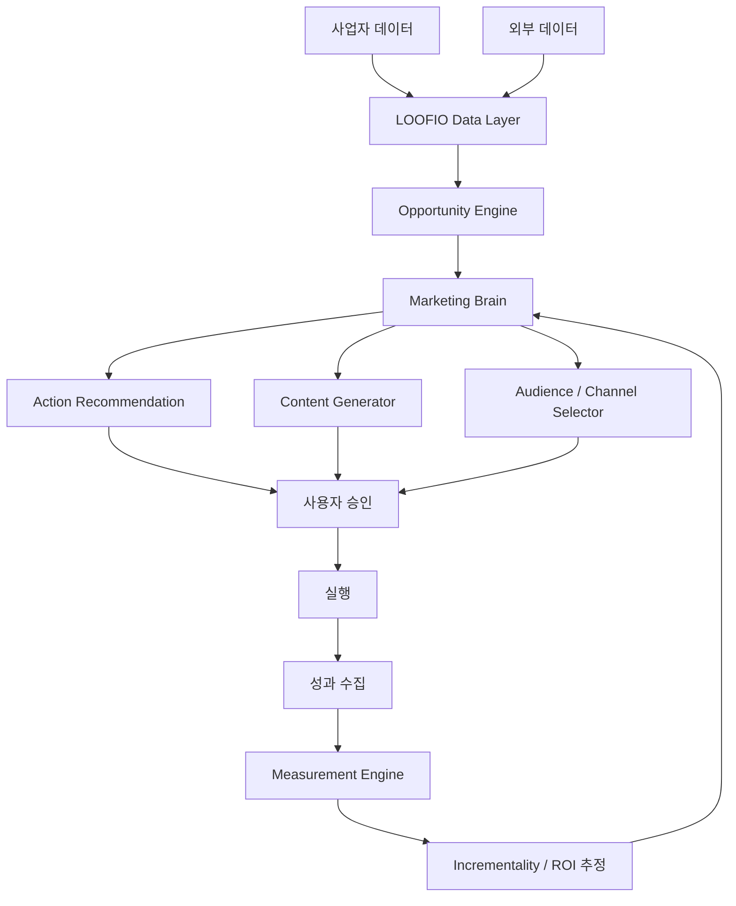

# LOOFIO 기술 로드맵 v1.0

> **제품 정의**  
> LOOFIO는 소상공인·중소기업의 사업 데이터를 지속적으로 관찰하고,  
> **아직 잡지 못한 매출 기회를 발견 → 적절한 마케팅 행동을 추천 → 실행 → 성과를 측정 → 다시 학습**하는  
> **AI 마케팅 매니저 SaaS**를 지향한다.

- 문서 버전: v1.0
- 기준일: 2026-08-13
- 구현 상태 검토일: 2026-08-17
- 대상: 초기 제품 기획 / MVP 개발 / 기술 검증
- 핵심 방향: `Generate → Decide → Act → Measure → Learn`

## 현재 구현 매핑

이 문서는 장기 제품 방향을 정의한다. 2026-08-17 기준 Hospital Appointment MVP의 실제 상태는 다음과 같다.

| Roadmap 영역 | 상태 | 구체적 범위 |
|---|---|---|
| Phase 0 데이터 기반 | 대부분 구현 | User/Tenant/Business, Appointment import, Offering/Customer 연결, Opportunity/Action/Result 저장 |
| Phase 1 데이터 관찰 | 구현 | CSV 정규화, 예약·매출 Metric, 4개 Detector, RevenueGap |
| Phase 1 기회 우선순위 | 구현 | versioned Opportunity와 `opportunity-score-v1` |
| Phase 1 Recommendation | 부분 구현 | 유형별 deterministic manual template와 사용자 결정. LLM 설명은 미구현 |
| 실행·성과 폐쇄 루프 | MVP 구현 | manual Action, Result, 직전 기간 baseline Measurement |
| AI Gateway·콘텐츠 | 미구현 | provider/model, structured AI output, 콘텐츠 생성 없음 |
| 외부 데이터·채널 | 미구현 | 날씨·상권·광고·메시지 connector 없음 |
| Incrementality | 미구현 | 현재 변화량은 단순 비교이며 인과효과가 아님 |
| Phase 2 이상 | 미구현 | 자동 실행, 세그먼트, A/B test, GEO, MMM 등 |

세부 기능·검증 상태는 `CURRENT_IMPLEMENTATION_STATUS.md`를 기준으로 한다.

---

## 1. 제품의 핵심 문제

기존 AI 마케팅 도구는 주로 다음 문제를 해결한다.

- SNS 게시물 생성
- 광고 문구 생성
- 이미지 생성
- 콘텐츠 일정 관리
- 채널별 자동 게시

하지만 소상공인이 실제로 원하는 것은 단순한 콘텐츠 생산이 아니다.

> **"지금 무엇을 해야 매출이 늘어나는가?"**

LOOFIO는 이 질문에 답하는 것을 핵심 가치로 삼는다.

---

## 2. LOOFIO의 핵심 가치 제안

### 기존 방식

```text
사용자
  ↓
"인스타그램 게시물 만들어줘"
  ↓
AI 콘텐츠 생성
  ↓
게시
```

### LOOFIO 방식

```text
사업 데이터
+
외부 데이터
+
마케팅 활동 데이터
        ↓
AI 분석
        ↓
매출 기회 탐색
        ↓
행동 추천
        ↓
사용자 승인
        ↓
실행
        ↓
성과 측정
        ↓
학습
```

LOOFIO의 핵심 결과물은 **콘텐츠 자체가 아니라 '다음 행동'**이다.

---

# 3. North Star Metric

LOOFIO의 장기 핵심 지표는 다음으로 정의한다.

## Incremental Revenue

> LOOFIO의 추천 또는 실행으로 인해 **추가로 발생했다고 추정되는 매출**

단순 지표는 보조적으로만 사용한다.

| 지표 | 중요도 |
|---|---:|
| 추가 매출 추정치 | ★★★★★ |
| 추천 실행률 | ★★★★☆ |
| 추천 후 매출 변화 | ★★★★★ |
| 재방문 / 재구매 | ★★★★☆ |
| 광고 ROAS | ★★★★☆ |
| 클릭률 | ★★★☆☆ |
| 콘텐츠 조회수 | ★★☆☆☆ |
| 좋아요 | ★☆☆☆☆ |

---

# 4. 전체 제품 구조



---

# 5. 필요한 데이터

LOOFIO는 처음부터 모든 데이터를 요구하지 않는다.

사용자가 제공 가능한 데이터 수준에 따라 단계적으로 확장한다.

## Level 1 — 최소 입력

사용자가 직접 입력할 수 있는 정보

- 업종
- 사업장 위치
- 주요 상품 / 서비스
- 가격
- 영업시간
- 주요 고객층
- 평균 객단가
- 월평균 매출 범위
- 현재 사용하는 마케팅 채널
- 대표적인 프로모션
- 사업 목표

### 목적

초기 추천과 기본 사업 프로필 생성

---

## Level 2 — 운영 데이터

가능한 경우 연동하거나 업로드한다.

- 일별 매출
- 시간대별 매출
- 상품별 판매량
- 주문 수
- 객단가
- 신규 / 재방문 고객
- 예약 데이터
- 쿠폰 사용
- 광고비
- 캠페인 데이터
- SNS 콘텐츠 성과

### 목적

실제 매출 패턴과 마케팅 행동 사이의 관계 분석

---

## Level 3 — 외부 데이터

LOOFIO가 자동으로 보강한다.

- 날씨
- 기온
- 강수량
- 공휴일
- 지역 행사
- 상권 정보
- 유동인구
- 인구통계
- 시간대별 생활인구
- 경쟁 업종 분포
- 지역 매출 통계
- 검색 트렌드
- 공공데이터
- 계절성

### 목적

"왜 매출이 변했는가?"에 대한 설명력을 높인다.

---

# 6. 핵심 기능 우선순위

| 기능 | MVP | Phase 2 | Phase 3 | R&D |
|---|:---:|:---:|:---:|:---:|
| 사업 프로필 | ✅ | | | |
| 매출 데이터 입력 | ✅ | | | |
| 공공데이터 연결 | ✅ | | | |
| 매출 이상 탐지 | ✅ | | | |
| 매출 기회 탐색 | ✅ | | | |
| AI 행동 추천 | ✅ | | | |
| 콘텐츠 생성 | ✅ | | | |
| 실행 기록 | ✅ | | | |
| 성과 비교 | ✅ | | | |
| 자동 채널 실행 | | ✅ | | |
| 고객 세그먼트 | | ✅ | | |
| Incrementality 추정 | | ✅ | | |
| A/B 테스트 | | ✅ | | |
| GEO 분석 | | | ✅ | |
| Creative Evaluator | | | ✅ | |
| MMM | | | ✅ | |
| Synthetic Consumer | | | | ✅ |
| Agentic Commerce | | | | ✅ |

---

# 7. Phase 0 — 데이터 기반 구축

## 목표

LOOFIO가 사업체를 이해할 수 있도록 기본 데이터 구조를 만든다.

### 구현

- 회원 / 사업장
- 사업 프로필
- 상품 / 서비스
- 매출 기록
- 마케팅 활동 기록
- 콘텐츠 기록
- 외부 데이터
- AI 분석 결과
- 추천 기록
- 실행 결과

---

## 기본 데이터 모델

```text
User
 └─ Business
      ├─ Product
      ├─ Sales
      ├─ CustomerSegment
      ├─ MarketingAction
      ├─ Campaign
      ├─ Content
      ├─ ExternalSignal
      ├─ Recommendation
      └─ Measurement
```

---

## 중요한 원칙

모든 AI 결과는 반드시 다음과 연결되어야 한다.

```text
Recommendation
       ↓
Action
       ↓
Result
```

즉,

> "AI가 무엇을 추천했는지"

뿐만 아니라

> "사용자가 실행했는지"

그리고

> "결과가 어떻게 변했는지"

까지 저장한다.

이 데이터가 장기적으로 LOOFIO의 가장 중요한 자산이 된다.

---

# 8. Phase 1 — MVP

## MVP 목표

> **사장님에게 매일 '오늘 무엇을 해야 하는지' 알려주는 시스템**

---

## MVP 핵심 화면

### 1. 오늘의 브리핑

예시:

```text
오늘 매출 기회

어제 저녁 18~21시 매출이
최근 4주 평균보다 17% 낮았습니다.

가능한 원인

- 비 영향
- 인근 행사 종료
- 저녁 신규 고객 감소

추천 행동

오늘 17~20시
신규 고객 대상 세트 메뉴 프로모션을 권장합니다.

예상 영향
+8~15% 주문 증가 가능성

[실행하기]
[수정하기]
[무시하기]
```

---

### 2. 매출 변화 탐지

AI가 자동으로 탐지한다.

```text
매출 감소
매출 증가
객단가 변화
특정 상품 급증
특정 상품 감소
시간대 변화
요일 변화
프로모션 영향
```

---

### 3. Opportunity Engine

LOOFIO의 핵심 엔진.

```text
데이터
 ↓
이상 탐지
 ↓
가능한 원인
 ↓
사업 기회
 ↓
추천 행동
```

예:

```text
비 오는 날
배달 주문 +27%

BUT

비 오는 날 광고 집행 없음

→ Opportunity 발견

"비 예보가 있는 날
배달 광고 예산을 늘리는 전략"
```

---

# 9. Recommendation Engine

추천은 다음 구조로 저장한다.

```json
{
  "problem": "평일 오후 매출 감소",
  "evidence": [
    "최근 4주 대비 -18%",
    "14~17시 방문자 감소"
  ],
  "hypothesis": "오후 신규 고객 감소",
  "action": "14~17시 한정 프로모션",
  "channel": "Instagram",
  "target": "20~30대 인근 직장인",
  "expected_effect": "+5~12% 매출",
  "confidence": 0.68
}
```

---

## 추천 생성 원칙

AI가 임의로 결론을 내리지 않도록 한다.

추천은 항상 다음 형식을 따른다.

```text
Observation
↓
Evidence
↓
Hypothesis
↓
Recommended Action
↓
Expected Impact
↓
Confidence
```

---

# 10. Phase 2 — Agentic Marketing

MVP 이후 핵심 확장 단계.

## 목표

추천만 하는 AI에서

> **실행 가능한 AI 마케팅 매니저**

로 발전한다.

---

## 구조

```text
Marketing Goal
       ↓
Planner Agent
       ↓
Data Agent
       ↓
Strategy Agent
       ↓
Content Agent
       ↓
Execution Agent
       ↓
Measurement Agent
```

---

## Agent 역할

### Data Agent

- 매출 분석
- 광고 분석
- 고객 분석
- 외부 데이터 분석

### Strategy Agent

- 문제 정의
- 마케팅 전략 결정
- 타겟 선택
- 채널 선택

### Content Agent

- 카피
- 이미지
- SNS 콘텐츠
- 광고 소재
- 쿠폰 메시지

### Execution Agent

- 예약 게시
- 캠페인 생성
- 고객 메시지 전송

### Measurement Agent

- 성과 측정
- baseline 비교
- uplift 계산
- 다음 액션 추천

---

# 11. Human-in-the-loop

초기 버전에서는 AI가 임의로 광고비를 사용하거나 게시하지 않는다.

```text
AI 추천
 ↓
사용자 승인
 ↓
실행
```

자동화 수준은 단계적으로 높인다.

### Level 0

추천만 제공

### Level 1

사용자 승인 후 실행

### Level 2

설정된 규칙 안에서 자동 실행

### Level 3

예산과 안전범위 안에서 자율 실행

---

# 12. Phase 2 — Incrementality

단순히 매출 전후를 비교하면 잘못된 결론이 나올 수 있다.

예:

```text
쿠폰 발행
↓
매출 +20%
```

하지만 그날 지역 축제가 있었다면 쿠폰 효과가 아닐 수도 있다.

따라서 장기적으로는 다음을 구분해야 한다.

```text
실제 매출 변화

=

자연 발생 변화
+
계절성
+
날씨
+
지역 이벤트
+
마케팅 효과
```

---

## 초기 MVP 측정

복잡한 causal model 이전에는:

- 최근 4주 평균
- 동일 요일
- 동일 시간대
- 시즌 조정
- 날씨 조정

등을 사용한 baseline을 만든다.

---

## 향후

- Difference-in-Differences
- Propensity Score
- Causal Forest
- Uplift Modeling
- Bayesian Causal Model
- Treatment Effect Estimation

으로 발전한다.

---

# 13. Phase 3 — GEO

## Generative Engine Optimization

AI 검색에서 사업체가 얼마나 노출되는지 측정한다.

대상:

- ChatGPT
- Gemini
- Google AI Search
- 기타 AI 검색 서비스

---

## 예시 질문

```text
성수동 데이트 카페 추천

서울숲 근처 조용한 카페

성수동 디저트 맛집

성수동 노트북 하기 좋은 카페
```

---

## GEO Score

```text
AI Visibility Score

=
등장 빈도
+
추천 순위
+
긍정 언급
+
인용 출처
+
경쟁사 대비 점유율
```

---

## 제공 기능

- AI 검색 노출 모니터링
- 경쟁업체 비교
- 추천 이유 분석
- 콘텐츠 개선
- 사업 정보 구조화
- FAQ 추천
- Local Entity 데이터 개선

---

# 14. Business Knowledge Graph

향후 매우 중요한 데이터 자산.

```text
Business
 ├─ Category
 ├─ Location
 ├─ Product
 ├─ Price
 ├─ Feature
 ├─ Customer
 ├─ OpeningHours
 ├─ Promotion
 ├─ Review
 ├─ FAQ
 ├─ Reservation
 └─ BrandIdentity
```

사람뿐만 아니라 AI agent도 읽을 수 있도록 구조화한다.

---

# 15. Phase 3 — Creative Intelligence

단순히 콘텐츠를 생성하지 않는다.

```text
20개 생성
 ↓
AI 평가
 ↓
상위 후보 선택
 ↓
사용자 선택
 ↓
실제 테스트
```

---

## Creative Score

예:

```text
Attention
Brand Fit
Message Clarity
CTA Strength
Visual Quality
Audience Fit
Predicted Engagement
```

---

## 목적

AI가 생성한 수많은 콘텐츠 중

> **실제로 사용할 가치가 높은 후보를 먼저 선별**

한다.

---

# 16. Phase 3 — Marketing Mix Modeling

데이터가 충분히 쌓인 고객에게 제공한다.

```text
Naver Ads
Instagram
Blog
Coupon
Influencer
Local Event
        ↓
MMM
        ↓
Channel ROI
        ↓
Budget Optimization
```

---

## 주요 결과

```text
현재 광고비
₩3,000,000

추천

Naver
₩1,000,000 → ₩700,000

Instagram
₩800,000 → ₩1,200,000

Coupon
₩500,000 → ₩700,000

Expected Revenue
+₩950,000
```

---

# 17. R&D — Synthetic Consumer

AI Persona를 실제 고객 대신 사용하는 것이 아니라

> **실제 캠페인 전에 사용하는 저비용 사전 실험 도구**

로 활용한다.

```text
광고 후보
 ↓
Synthetic Consumer Panel
 ↓
예상 반응
 ↓
콘텐츠 수정
 ↓
실제 A/B Test
```

---

# 18. R&D — Agentic Commerce

장기적으로 AI agent가 사업자와 소비자를 연결하는 구조를 고려한다.

```text
Customer AI
 ↓
상품 탐색
 ↓
LOOFIO Business Agent
 ↓
상품 / 가격 / 프로모션
 ↓
예약 / 주문
```

LOOFIO는 미래에

> **AI가 사업자를 이해할 수 있게 만드는 인터페이스**

역할을 할 수 있다.

---

# 19. 데이터 Flywheel

LOOFIO의 장기 경쟁력은 모델 자체보다 데이터에서 만들어진다.

```text
추천
 ↓
사용자 선택
 ↓
실행
 ↓
성과
 ↓
학습
 ↓
더 좋은 추천
```

쌓이는 데이터:

- 어떤 추천을 했는가
- 사용자가 무엇을 선택했는가
- 무엇을 수정했는가
- 무엇을 거절했는가
- 어떤 콘텐츠를 선택했는가
- 실제 매출이 어떻게 변했는가

---

# 20. MVP에서 하지 않을 것

초기 제품에서는 다음을 의도적으로 제외한다.

- 완전 자동 광고 집행
- 모든 SNS 채널 지원
- 고급 MMM
- 복잡한 고객 CDP
- 대규모 Marketing Automation
- AI 검색 순위 보장
- 완전한 causal inference
- 대행사용 multi-tenant white label
- 고급 synthetic consumer
- Agentic Commerce

MVP의 목적은 기능 개수가 아니다.

> **"LOOFIO가 실제 사업자에게 유용한 매출 기회를 찾아줄 수 있는가?"**

를 검증하는 것이다.

---

# 21. MVP 핵심 사용자 Flow

```text
1. 회원가입
   ↓
2. 사업체 입력
   ↓
3. 기본 사업 데이터 입력
   ↓
4. 매출 데이터 업로드 / 연동
   ↓
5. 외부 데이터 자동 결합
   ↓
6. AI 분석
   ↓
7. 오늘의 매출 기회
   ↓
8. 추천 마케팅 행동
   ↓
9. 사용자 승인
   ↓
10. 콘텐츠 생성
   ↓
11. 실행
   ↓
12. 결과 입력 / 자동 수집
   ↓
13. 성과 분석
```

---

# 22. MVP 필수 화면

## Dashboard

```text
오늘 매출
주간 매출
매출 변화
LOOFIO 발견 기회
실행 중 액션
최근 성과
```

## Opportunity

```text
문제
근거
가능한 원인
추천
예상 효과
Confidence
```

## Action

```text
추천 행동
타겟
채널
콘텐츠
실행일
상태
```

## Results

```text
실행 전 baseline
실행 후 매출
예상 효과
실제 효과
학습 결과
```

---

# 23. 기술 모듈

```text
/apps

/api

/modules

  /business
  /sales
  /marketing
  /external-data

/ai

  /analysis
  /opportunity
  /recommendation
  /content
  /measurement

/connectors

  /public-data
  /weather
  /analytics
  /advertising

/data

/jobs

/monitoring
```

---

# 24. AI Architecture

LLM 하나가 모든 것을 판단하지 않는다.

```text
Raw Data
 ↓
Deterministic Analytics
 ↓
Feature Extraction
 ↓
Opportunity Detection
 ↓
LLM Reasoning
 ↓
Recommendation
```

숫자 계산은 가능한 한 코드 / 통계 엔진으로 수행한다.

LLM은 다음 역할에 집중한다.

- 의미 해석
- 원인 가설 생성
- 추천 설명
- 전략 수립
- 콘텐츠 생성

---

# 25. AI Guardrail

LLM이 다음을 직접 생성하지 않도록 한다.

- 매출 수치 계산
- ROI 계산
- 통계 검정
- 광고 예산 합산
- 증감률 계산

해당 값은 서버에서 계산 후 LLM에 전달한다.

---

# 26. 추천 Confidence

모든 추천에는 Confidence를 표시한다.

예:

```text
High

최근 12회 동일 패턴 확인
데이터 충분

Medium

최근 4회 확인
외부 요인 가능

Low

데이터 부족
실험 필요
```

LOOFIO가 모르는 것을 아는 척하지 않도록 한다.

---

# 27. KPI

## Product KPI

- Weekly Active Businesses
- Opportunity View Rate
- Recommendation Acceptance Rate
- Action Completion Rate
- 4주 Retention

## Business KPI

- Incremental Revenue
- Revenue Lift
- ROAS
- Repeat Purchase
- Customer Acquisition

## AI KPI

- 추천 실행률
- 추천 성공률
- 사용자 수정률
- 사용자 거절률
- Confidence Calibration

---

# 28. 첫 90일 개발 로드맵

## Month 1 — Foundation

### 목표

사업 데이터와 매출 데이터를 안정적으로 수집한다.

### 구현

- 인증
- 사업 프로필
- 상품
- 매출 입력
- CSV 업로드
- 외부 데이터 연결
- 기본 Dashboard
- DB schema

### 완료 조건

```text
하나의 사업체에 대해

사업 정보
+
30일 매출
+
외부 데이터

조회 가능
```

---

## Month 2 — Intelligence

### 목표

LOOFIO가 매출 변화와 기회를 탐지한다.

### 구현

- 매출 baseline
- anomaly detection
- 요일 / 시간대 분석
- Opportunity Engine
- AI 원인 분석
- Recommendation Engine

### 완료 조건

```text
데이터 입력
↓
LOOFIO가
최소 1개 이상의
설명 가능한 마케팅 기회를 생성
```

---

## Month 3 — Action & Measurement

### 목표

추천 → 실행 → 결과의 loop를 완성한다.

### 구현

- Action 생성
- 콘텐츠 생성
- 사용자 승인
- 실행 기록
- 결과 기록
- baseline 비교
- effect report

### 완료 조건

```text
Opportunity
↓
Recommendation
↓
Action
↓
Result
↓
Measurement
```

전체 loop가 하나의 사업체에서 끝까지 동작한다.

---

# 29. MVP 성공 조건

초기 사용자 테스트에서 다음 질문에 답한다.

### Q1

LOOFIO가 발견한 문제가 실제 사업자의 체감과 일치하는가?

### Q2

LOOFIO 추천이 사장님이 실행할 만큼 구체적인가?

### Q3

추천 행동 이후 실제 매출 변화가 관찰되는가?

### Q4

사용자가 다음 주에도 LOOFIO를 열어보는가?

---

# 30. Go / No-Go 기준

## GO

다음 중 최소 3개가 만족되면 다음 단계로 진행한다.

- 주 3회 이상 Dashboard 방문
- 추천 실행률 30%+
- 추천 만족도 70%+
- 사용자 50% 이상이 매출 관련 새로운 인사이트를 발견
- 실행 액션 중 의미 있는 매출 변화 사례 발생

## NO-GO

다음이 반복되면 제품 방향을 재검토한다.

- 추천이 너무 일반적
- 데이터 입력 부담이 큼
- 추천과 매출의 연결이 약함
- 콘텐츠 생성만 사용
- 사장님이 결과를 신뢰하지 않음

---

# 31. 가장 중요한 제품 원칙

## Principle 1

**콘텐츠보다 매출**

## Principle 2

**생성보다 의사결정**

## Principle 3

**추천보다 실행**

## Principle 4

**실행보다 측정**

## Principle 5

**AI 답변보다 데이터**

---

# 32. 최종 제품 방향

LOOFIO가 지향하는 최종 형태는 다음과 같다.

```text
사장님

"오늘 뭐 해야 돼?"

          ↓

LOOFIO

"오늘 오후 신규 고객 매출이
평균보다 낮을 가능성이 높습니다.

지난 8주 데이터를 보면
목요일 15~18시 매출이 가장 약합니다.

현재 비 예보가 있고
과거 비 오는 날 배달 매출은 23% 높았습니다.

오늘 16시부터
배달 고객 대상 세트 프로모션을 추천합니다.

예상 추가매출
₩120,000 ~ ₩210,000

실행할까요?"
```

LOOFIO의 핵심 경쟁력은

> **AI가 마케팅을 만들어주는 것**

이 아니라

> **AI가 사업 데이터를 이해하고 다음 매출 기회를 찾아주는 것**

이다.

---

# 33. 기술 발전 순서 요약

```text
Phase 0

Data Foundation
        ↓

Phase 1

Opportunity Detection
+
Recommendation
        ↓

Phase 2

Agentic Marketing
+
Incrementality
        ↓

Phase 3

GEO
+
Creative Intelligence
+
MMM
        ↓

R&D

Synthetic Consumer
+
Agentic Commerce
```

---

# 34. 다음 개발 우선순위

현재 가장 먼저 정의해야 할 것은 다음 5개다.

1. **LOOFIO 사업 데이터 스키마**
2. **소상공인에게 실제 받을 수 있는 데이터 목록**
3. **Opportunity Engine 규칙**
4. **Recommendation Output Schema**
5. **MVP Dashboard UX**

이 5개가 확정되면 실제 DB 설계와 API 설계로 넘어간다.

---

# 35. 다음 문서 후보

LOOFIO 개발 문서는 아래 순서로 확장한다.

```text
01_PRODUCT_VISION.md
02_TECH_ROADMAP.md
LOOFIO_DATA_SCHEMA_V1.md
04_OPPORTUNITY_ENGINE.md
05_RECOMMENDATION_ENGINE.md
06_AI_ARCHITECTURE.md
07_MVP_SPEC.md
08_API_SPEC.md
09_MEASUREMENT_FRAMEWORK.md
```

**데이터 스키마 현재 문서: `LOOFIO_DATA_SCHEMA_V1.md`**

현재 Hospital MVP의 저장 구조와 migration mapping은 데이터 스키마 문서에 반영됐다. 새 Domain Adapter와 External Context를 추가할 때 같은 문서를 확장한다.
